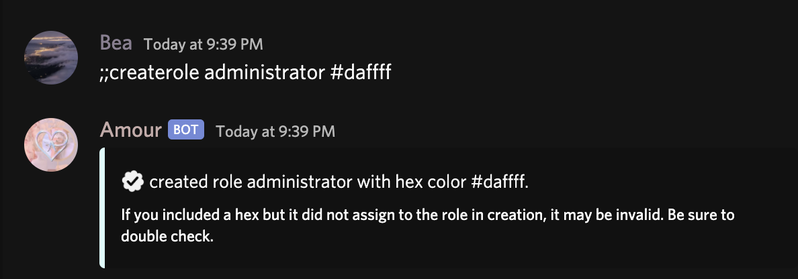

# Admin Commands

### ;;createrole

Creates a new role with a hex color & rolename.  
**Usage:** ;;createrole \[rolename\] \(hexcolor optional\)

If no hex color is provided, it will not set a color.

### ;;deleterole

Deletes the mentioned role.  
**Usage:** ;;deleterole \[role\]

### ;;handled

Replies to a ;;helpdesk request. For staff only.  
**Aliases:**  
;;helpreply  
**Usage:** ;;handled \[user\] \[comment\]

