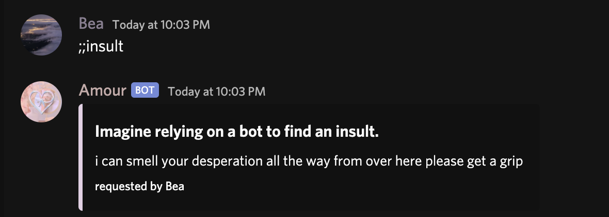

# Fun Commands

### ;;8ball

Get Amour's thoughts on any question you have!  
**Usage:** ;;8ball \[question\]

### ;;afk

Set your status to afk using Amour.  
**Usage:** ;;afk \[optional status\]

If you are pinged while AFK, Amour will inform the user.

When you return, Amour will remove your AFK.

### ;;birthday

Get someone's birthday, set your birthday or see the birthday list for your guild's member's birthdays for different months!  
**Usage:**  
;;birthday \(user\)  
;;birthday  
;;birthday set \(DD/MM/YYYY\)  
;;birthday month \(1/2/3/4/5/6/7/8/9/10/11/12\) - views server birthdays.  
;;birthday off   
  

To lookup a servers birthdays for the month, you can use ;;birthday month \(month number\).

To turn off your birthday, you can use ;;birthday off

### ;;cat

Get a random cat picture off reddit!  
**Usage:** ;;cat

### ;;coinflip

Amour will flip a coin for you and tell you the result!  
**Usage:**   
;;cf  
****;;coinflip  
amourbot, flip a coin

### ;;cow

Get a random cow photo, hand-curated by Amour's team!  
**Usage:** ;;cow

### ;;divorce

Divorce your marriage partner with Amour. \):  
**Usage:** ;;divorce

### ;;dog

Get a random dog photo from the reddit community!  
**Usage:** ;;dog

### ;;hug

Hugs yourself or the mentioned user.  
**Usage:** ;;hug \[user\]  
Mentioning a user is optional.

### ;;hypixelfriends

Get a Hypixel player's friend list.  
**Usage:** ;;hypixelfriends \(minecraft user\)

### ;;hypixelpl

Get statistics on a Hypixel player like rank, level, achievement points and more!  
**Usage:** ;;hypixelpl \(minecraft user\)

### ;;imgur

Uplaod one or more images to imgur \(gifs are not working\)  
**Usage:** ;;imgur \(attachment only\)

### ;;insult

Get a random insult, with more being generated every month!  
**Aliases:**  
;;roast  
**Usage:** ;;insult

### ;;kiss

Kiss the mentioned user. Awwww!  
**Usage:**  
;;kiss  
;;kiss \(user\)

### ;;lastfm

Get the statistics of a last.fm user.  
**Usage:**  
;;lastfm \(username\)  

### ;;love

Works as a love calculator, as Amour calculates the love affinity between you and a random person or person mentioned!  
**Aliases:**  
;;affinity  
;;ship  
**Usage:**  
;;love  
;;love \(user\)

### ;;marriage

Get the marriage status of a user.

**Aliases:** ;;partner  
**Usage:**  
;;marriage  
;;marriage \(user\)

### ;;marry

Propose to someone!  
**Usage:**  
;;marry \(user\)

### ;;mcnames

Get past usernames of a Minecraft player.  
**Usage:** ;;mcnames \(minecraft username\)

### ;;mcskin

Get a Minecraft user's skin & UUID  
**Usage:** ;;mcskin \(minecraft username\)

### ;;meme

Get a random meme off the depths of Reddit.  
**Usage:** ;;meme

### ;;mock

Mock the specified text like spongebob!  
**Usage:**  
;;mock \(text\)

### ;;nmcfr

Gets the friend list of a NameMC user. You must have a verified Minecraft premium account to register for NameMC.  
**Usage:** ;;nmcfr {username}

### ;;pick

Picks an option from a list  
**Usage:** ;;pick \[option 1, option 2, option 3\] etc.

### ;;poll

Start a poll on some options. Maximum time is 24 hours.  
**Usage:**  
;;poll \(time\) option1 \| option2 \| option3 \(and so on\)

### ;;rps

Play rock paper scissors with Amour!  
**Usage:** ;;rps

### ;;slap

Slap the mentioned user! Oh no!  
**Usage:**  
;;slap  
;;slap \(user\)

### ;;weheartit

Generate a random we heart it \(similar to pinterest\) collection, curated by Amour's developer.  
**Aliases:** ;;whi   
**Usage:**  
;;weheartit  
;;whi

