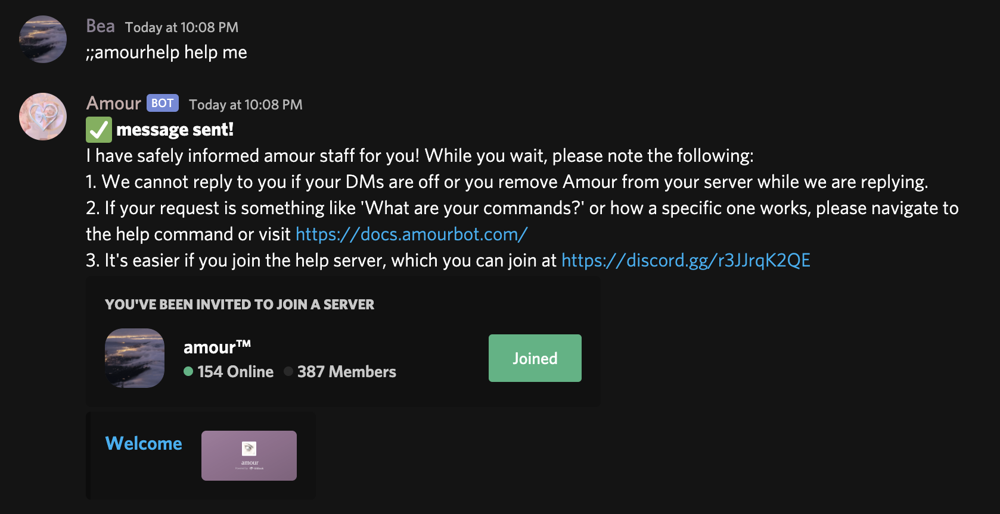
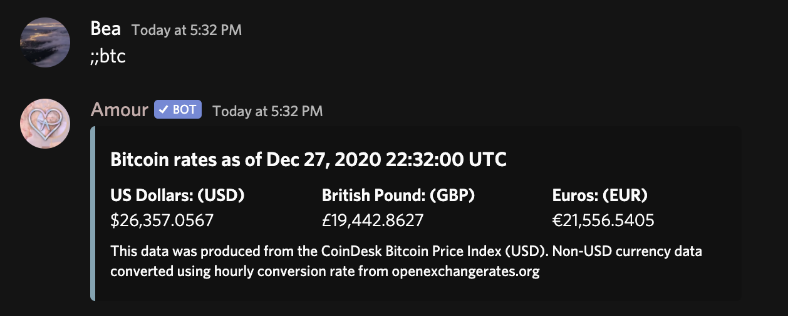
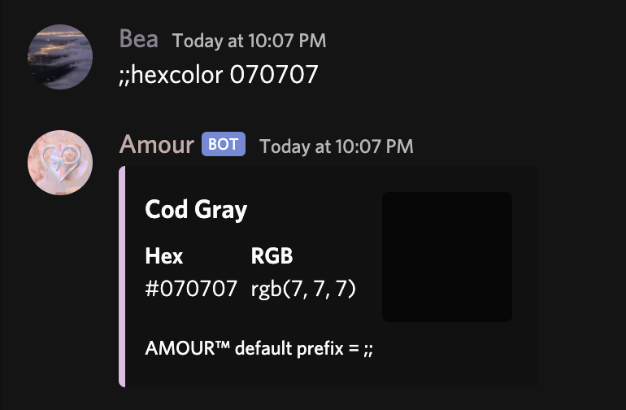

# Informational Commands

### ;;addbot

Receive the invite link to add Amour to your server.\
**Usage:** ;;addbot

### ;;amourhelp

Send a message to the Amour development team.\
**Usage:**\
****;;amourhelp \[message]\
;;amourhelp

### ;;avatar

Get Amour's thoughts on any question you have!\
**Usage:** \
****;;av \[user optional]\
;;avatar \[user optional]

### ;;bitcoin

Get current Bitcoin price in USD, GBP & EUR.\
**Usage:** \
****;;bitcoin\
;;btc

### ;;covid

Get statistics on COVID-19 globally or in a country.\
**Aliases:**\
;;coronavirus\
;;covidstats\
**Usage:**\
****;;covid \[country]

If you mention a country, it will return specific data for that country.

### ;;credits

Sends the credits on the creation of Amour.\
**Aliases:**\
;;creds\
**Usage:** ;;credits

### ;;help

**Aliases:**\
;;commands

Shows full command list, dynamically updates.\
**Usage:** ;;help \[;;commandname optional]

### ;;helpdesk

Get Amour's thoughts on any question you have!\
**Usage:**\
****;;helpdesk \[message]\
;;helpdesk

Usage of ;;helpdesk is easy. You can go either of two ways to use ;;helpdesk.

#### Method One - In-Server Message

You can use the command as shown below, and the ;;helpdesk command message will automatically be deleted when sent to staff in case your request has private information.

#### Method Two - DM Message

Either way will keep your request private. However, if you'd like to remember your request as well and have DM history, you can use ;;helpdesk and the bot will reach out, as shown below.

After you execute the command, here is an example of what DM conversation with Amour would look like.

Once you have let the bot know what your message is, whether it's in server or in DMs, this is what your request will come out as in the channel set with for ;;sethelpreq:

### ;;hexcolor

Gets a hex color's information including rgb value, color preview and it's original name.\
**Aliases:**\
;;color\
;;hexcolour\
;;colour\
;;hex\
**Usage:** ;;hexcolor {#hex with or without #}

### ;;leaderboard

Shows the leaderboard for partnerships completed in Amour by day, week, month and all-time.\
**Aliases:**\
;;leaderboards\
;;lb\
;;partnertop\
**Usage:** ;;leaderboard

### ;;partners

Get the amount of partners you or someone else has completed.\
**Usage:** ;;partners \[user optional]

### ;;serverinfo

Get information about a server.\
**Usage:**\
****;;guildinfo\
;;serverinfo

### ;;status

Get Amour's statuses.\
**Usage:** ;;status

### ;;suggest

Suggest a feature for amour!\
**Usage:** ;;suggest \[suggestion]

### ;;support

Sends an invite link to the support server.\
**Usage:** ;;support

### ;;weather

Gets the weather in any US state from zip code or a country.\
**Usage:** ;;weather \[zip code | city, countrycode]

