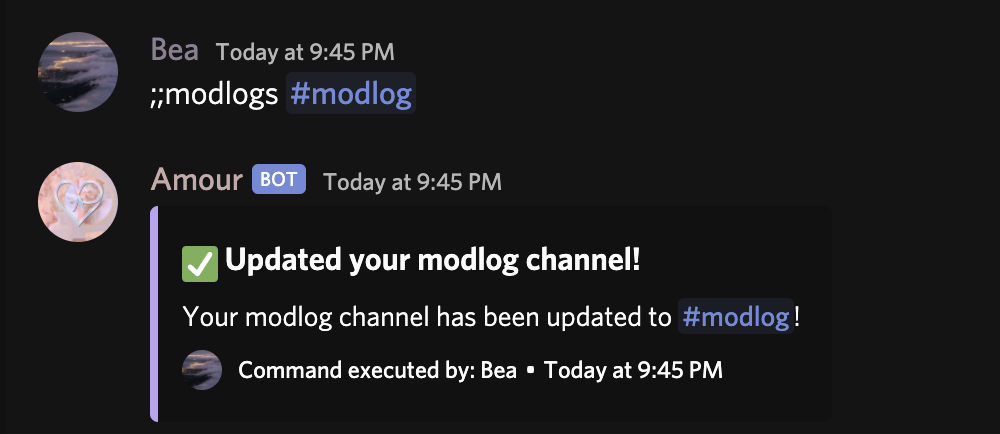
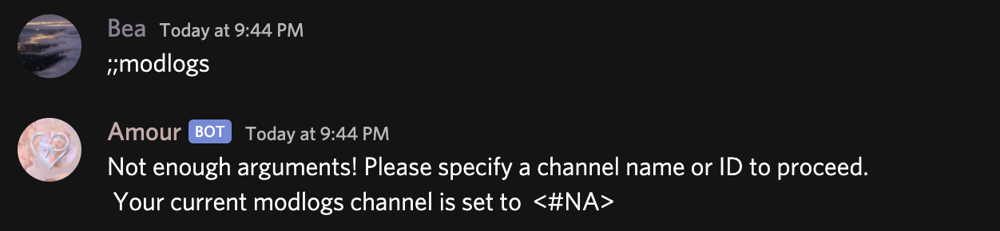
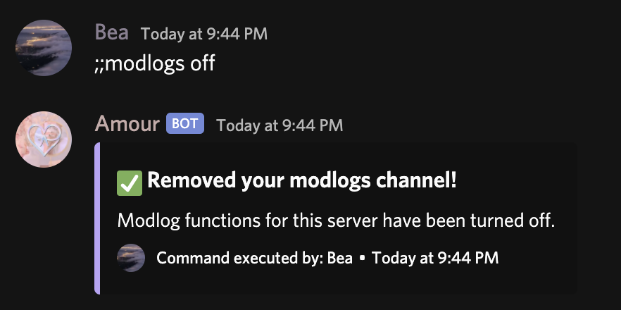

# ModLogs

The modlogs channel function of Amour sends any modlog data for bans, kicks and unbans to this mentioned channel. This is optional of course and can be toggled.

### Usage:

;;modlogs \[channel \| off\]  
\[channel\] Can include using:

* The channel ID,
* Or, tagging the channel with \#

#### Example:

If you do not add arguments after ;;modlogs, it will return your modlogs channel.

Of course, to disable modlogs, you can use ;;modlogs off.

Whenever a punishment is issued, it will send the details in your modlogs channel. If no channel is set, it will not.

