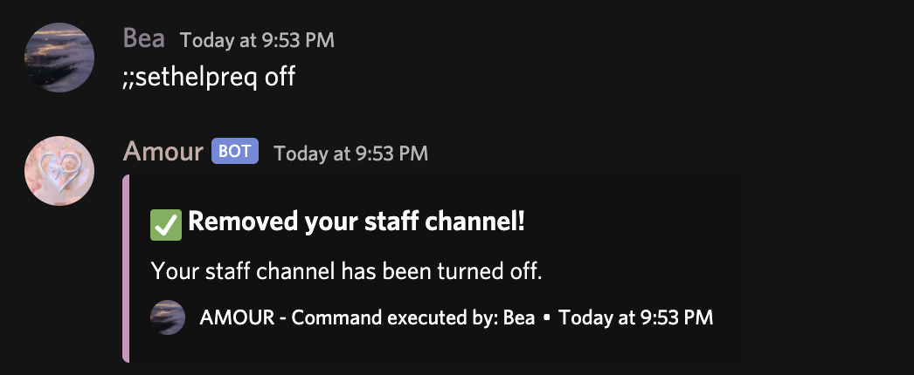

# Modmail

The modmail function is used in order to help users get help from the staff who manage a server Amour is in. This function can be used with the command ;;helpdesk by anyone in a server channel as long as the database is set up.

### Usage:

;;sethelpreq \[channel\]  
Channel can be defined as:

* Either the channel ID,
* Or, the channel itself e.g \#help

#### Example:

To disable the modmail feature if it's already set up, use ;;sethelpreq off and Amour will disable it.

