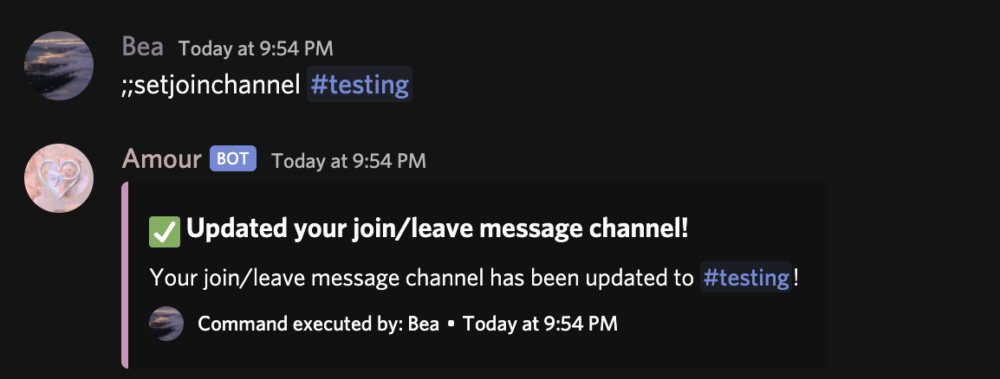
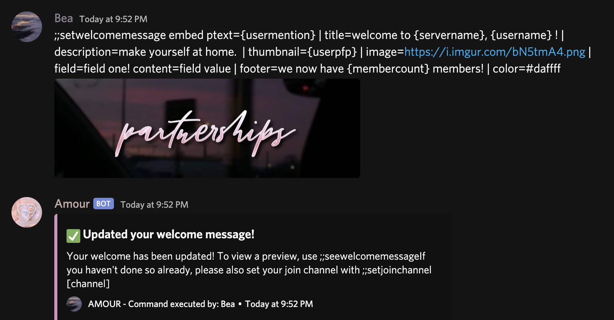
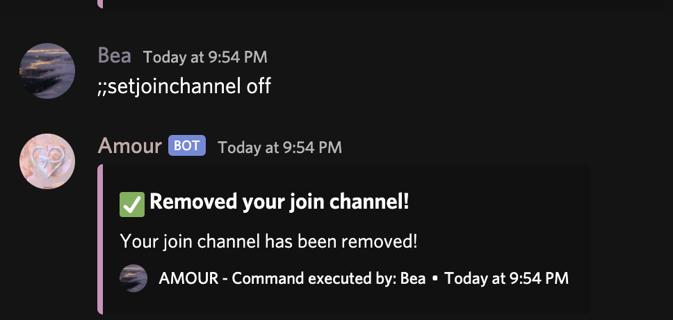
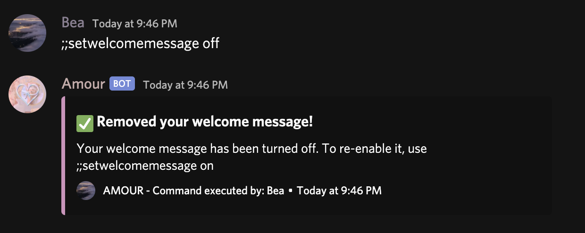
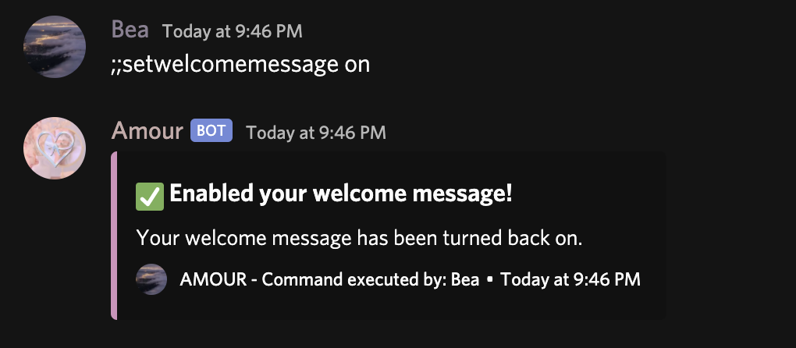
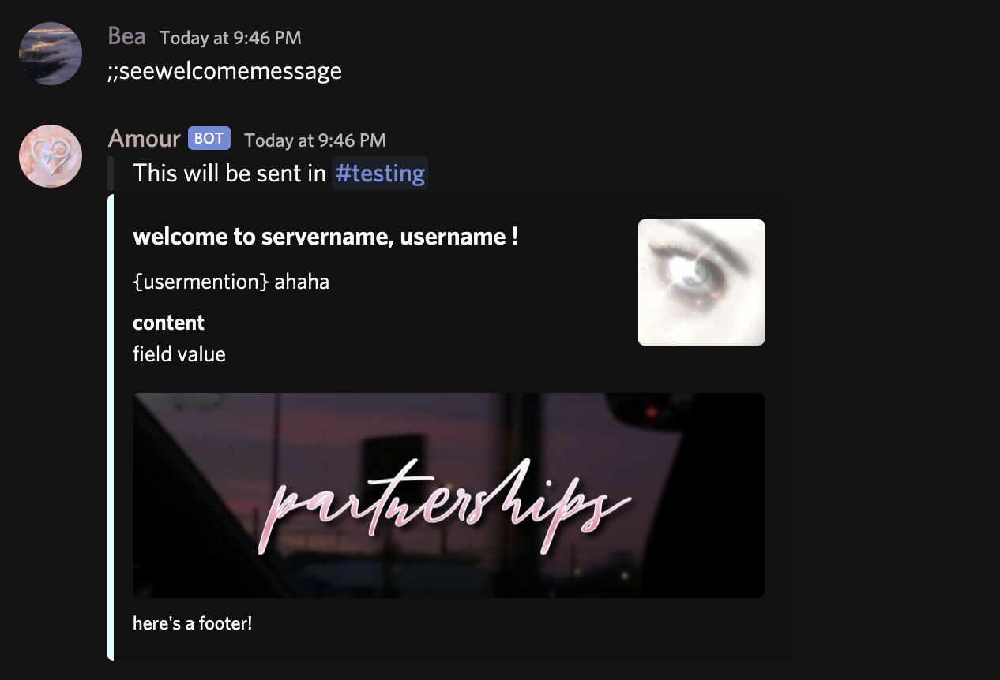

# Join Channel

The join channel function of Amour sends a message to the set join channel when a new member comes. This is optional of course and can be toggled.

### Usage:

;;setjoinchannel \[channel\]  
\[channel\] Can include using:

* The channel ID,
* Or, tagging the channel with \#

#### Example:

## Welcome Message

Once the channel has been set up, you still need to set a welcome message. You can do so like below. Example usage: 

;;setwelcomemessage embed ptext={usermention} \| title=welcome to {servername}, {username} ! \| description=make yourself at home. \| thumbnail={userpfp} \| image=[https://i.imgur.com/bN5tmA4.png](https://i.imgur.com/bN5tmA4.png) \| field=field one! content=field value \| footer=we now have {membercount} members! \| color=\#daffff

#### Placeholders:

Placeholders are very useful for welcome messages to replace data and make it dynamic. Here are the following placeholders you can use when setting a welcome embed:

{servername} - get your server name.  
{username} - get the new user's username.  
{usermention} - mention the new user.  
{membercount} - get your server's member count.  
{usertag} - get the users tag e.g Bea\#0001  
{userpfp} - get the user's profile photo.

To disable your welcome channel, use ;;setjoinchannel off.

To disable your welcome message function, use ;;setwelcomemessage off.

To turn it back on, use ;;setwelcomemessage on.

### See Welcome Message

To see your welcome message, use ;;seewelcomemessage.

